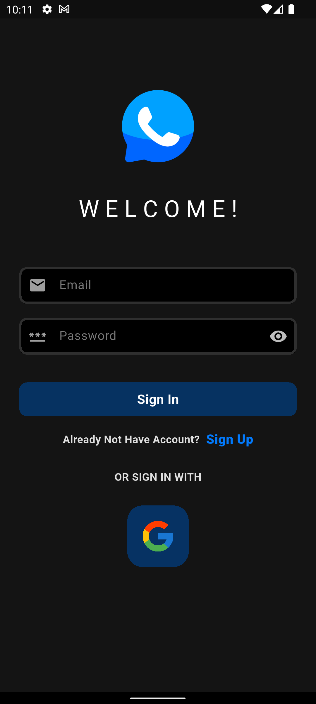

# Chat App – Firebase & Flutter

A real-time chat application built with **Flutter** and **Firebase**.  
It allows users to sign up (Google / Email), chat one-to-one with other users, and share images directly from the **camera** or **gallery**.  
The app includes a welcome screen, full **Dark/Light mode** support, and secure Firebase integration.

---

## Features

- **Authentication** with Firebase (Google Sign-In, Email & Password).
- **One-to-one chat** with text and media support.
- **Send images** directly from camera or gallery.
- **Firebase Storage** for images and **Firestore** for chat messages.
- **Welcome screen** & onboarding before login.
- **Dark / Light Mode** with dynamic switching.
- Responsive UI, scalable architecture using **BLoC / Provider**.

---

## Tech Stack

- Flutter & Dart
- Firebase Authentication
- Firebase Firestore (real-time database)
- Firebase Storage (media handling)
- State Management: **BLoC / Provider**
- Image Picker & Cached Network Image
- Dio (for networking if needed)

---

## Screenshots

  
  
  
  
  
  
  
  
  

---

## Demo Videos

- [Watch Demo on TikTok](https://www.tiktok.com/@mo7amedfawzy6/video/7482023391516544264?is_from_webapp=1&sender_device=pc)
